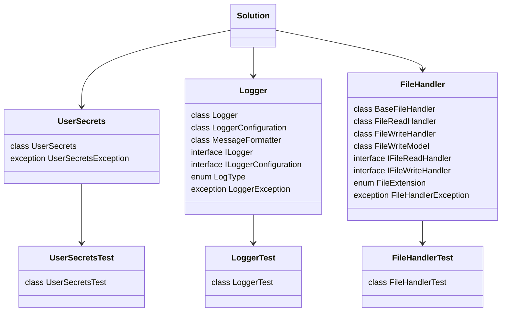

  

    
    <h1>joerivanarkel.Packages</h1>
  

  

    
  

<!--

-->

In this repository, the owner has published packages that they use in their own projects. These packages are available on both [NuGet](https://www.nuget.org/profiles/joerivanarkel) and in this repository as Github Packages.

These packages vary from simple wrappers around existing packages to custom packages that are used in multiple projects. The packages are listed [below](#packages). For more information about a specific package, click on the package name. This will take you to the package's README file. This file contains information about the package, such as how to use it.

## Packages
| Package | Version | Description |
| --- | --- | --- |
| [joerivanarkel.UserSecrets](./joerivanarkel.UserSecrets/README.md) |  | This package is a simple wrapper around the [Microsoft.Extensions.Configuration.UserSecrets](https://www.nuget.org/packages/Microsoft.Extensions.Configuration.UserSecrets/) package. |
| [joerivanarkel.Logger](./joerivanarkel.Logger/README.md) |  | This package is a custom logger that logs to a file. |
| [joerivanarkel.FileHandler](./joerivanarkel.FileHandler/README.md) |  | This package which handles read and write operations to files. |

## Solution Structure
<i>As of 22 of July 2023</i> 
The solution has a number of projects. For each package, there is a project that contains the package. In addition, there is a project that contains the tests for the package. The package has a relation with the Solution entity. The solution structure is shown below.

